  

# Hi, I'm Fathi 👋

Software Engineer

Backend • Data Engineering • Mobile • Full-stack

DTU • HackYourFuture • SmartService ApS

Building data platforms, scalable APIs, and mobile applications.

📍 Denmark  
🔗 https://github.com/fathionsons  
💼 https://www.linkedin.com/in/fathifonsman/

---

## 🧰 Tech Stack

---

## 🚀 What I'm focusing on

- Building scalable **data platforms and pipelines**
- Backend architecture and API design
- Mobile application development
- Cloud-based data engineering workflows

---

## 📊 GitHub Stats

---

## 📈 Contribution Activity

---

## 🤝 Connect with me

💼 LinkedIn  
https://www.linkedin.com/in/fathifonsman/
